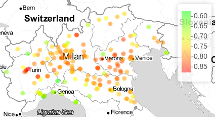

```{r setup, include=FALSE}
source("code/include_all.R")
knitr::opts_chunk$set(echo = TRUE)
```

# Data visualization
The first analysis we've done was aimed to understand how many stations revealed levels of concentration above the limit threshold. To do so we plotted an histogram of the number of days in which a station was above such threshold in the year 2019:

```{r, eval=F, echo=T}
day_above_limit <- function(year){
  poll <- loadData(year)
  max_daily_val = 50 #critic daily level 
  max_dang_days = 35
  
  #stores for every station the num of "dangerous" days
  n_dang_days = colSums(poll>max_daily_val) 
  
  #hist of the stations divided for the number of dangerous days
  hist(n_dang_days, breaks = 20, main=paste('Days above the limit per station (',year,')',sep=''), 
       xlab='n. of days above the limit', ylab='n. of stations', xlim=c(0,125), ylim=c(0,35)) 
  abline(v=max_dang_days, col='red')
}
```

```{r,out.width="70%", fig.align='center'}
day_above_limit(2019)
```

commento su questo plot

Then we proceeded analizing the PM10 concentration of 10 station just to have an idea of the level and seasonality of the time series.

```{r, eval=F, echo=T}
matplot1 <- function(){
  poll <- loadData(2019)
  set.seed(5)
  rand_st <- sample(1:dim(poll)[2], 10)
  days= seq(as.Date("2019-01-01"), as.Date("2019-12-31"), by="days")
  matplot(days,poll[,rand_st],type='l',xlab='Time',ylab='PM10 (µg/m^3)', main="Timeseries of 10 stations (2019)")
}
```

```{r,out.width="70%",, fig.align='center'}
matplot1()
```

We can see how the time-series are pretty similar in level and seasonality.

Moreover, to give another insight on the seasonality trend we computed the mean of the stations in each year and compared:

```{r, eval=F, echo=T}
matplot2 <- function(){
  
  pollutant <- read.csv('code/data/timeSeriesData.csv')
  N = dim(pollutant)[1] #time instants
  YEARS <- 7
  
  daily.avg = rep(0,N) #Mean in the day if there is at least one valid value
  for(i in 1:N){
    daily.avg[i] = mean(as.numeric(pollutant[i,]), na.rm=T)
  }
  
  avg_per_y = matrix(NA, nrow = 365, ncol = YEARS)
  
  for (y in 1:YEARS){
    avg = rep(0,365)
    for(d in 1:365){
      i = (y-1)*365 + d
      avg_per_y[d,y] = daily.avg[i]
    }
  }
  
  days= seq(as.Date("2019-01-01"), as.Date("2019-12-31"), by="days")
  matplot(days,avg_per_y,type='l',xlab='Time',ylab='PM10 (µg/m^3)', main='Average concentration of PM10 per day',col=1:YEARS,lty=1)
  legend('topright',legend=2013:(2013+YEARS-1),col=1:YEARS,lty=1, cex=0.8)
}
```

```{r,out.width="70%",, fig.align='center'}
matplot2()
```

commento su questo plot


# Persistence analysis

We then proceeded estimating the values of $\rho$ and $\sigma^2$ through an autorgeressive process of order 1 using the R package \texttt{arima},

```{r, eval=F, echo=T}
arima_model <- function(){
  pollutant <- read.csv('code/data/timeSeriesData.csv')
  rho <- c()
  sigma <- c()
  for(r in 1:dim(pollutant)[2]){
    a = arima(as.numeric(pollutant[,r]), order=c(1,0,0))
    rho[r] = as.numeric(a$coef[1])
    sigma[r] = sqrt(as.numeric(a$sigma2))
    
  }
  return(list(rho=rho,sigma=sigma))
}
```

and plotted its distribution both on an histogram:

```{r,out.width="70%",, fig.align='center'}
arimaModel <- arima_model()
hist(arimaModel$rho, breaks = 25,main="Distribution of rho's")
```

and on the Northern Italy map:

```{r, eval=F, echo=T}
plot_rho <- function(rho){
  stat_inf <- read.csv('code/data/stationsInfo.csv')
  sigma <- rep(NaN,length(rho))
  plotData <- data.frame(site=stat_inf$site,rho=rho,sigma=sigma,
                         latitude=stat_inf$latitude,longitude=stat_inf$longitude)
  
  #plot on the map
  pal <- colorNumeric(
    palette = colorRampPalette(c('green', 'yellow', 'red'))(length(plotData$rho)), 
    domain = plotData$rho)
  
  
  map <- leaflet() %>% addProviderTiles(providers$Stamen.TonerLite,
                                        options = providerTileOptions(noWrap = TRUE)
  )
  map%>%
    addCircleMarkers(plotData$longitude,plotData$latitude, 
                     color = pal(plotData$rho),
                     radius = 2, 
                     label = plotData$rho, 
                     labelOptions = labelOptions(textsize = "12px"),
                     popup = plotData$site_type
    )%>% addLegend('topright',
                   pal = pal,
                   values = plotData$rho)
}
```

```{r}
plot_rho(arimaModel$rho)
```

<!-- The RMarkdown cannot knit an html image, so we upload the saved image, the graph is still replicable running the above chunk-->


In particular, it can be noted a mixture distribution of the $\boldsymbol{\rho}$'s and therefore we believe that by using this strategy, we may be able to obtain a reasonable cluster.
In the last figure you can see the distribution of the  $\rho_i$ for each station considered. The green points are the stations with a low value of $\rho$, so a low persistence, while the red points are the ones with persistent time series. 
In particular, we can see that in the Po valley the persistence is high while in the zones near the sea or in a more mountaineer city the value of the persistence is smaller.